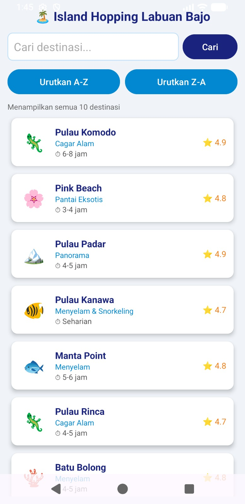
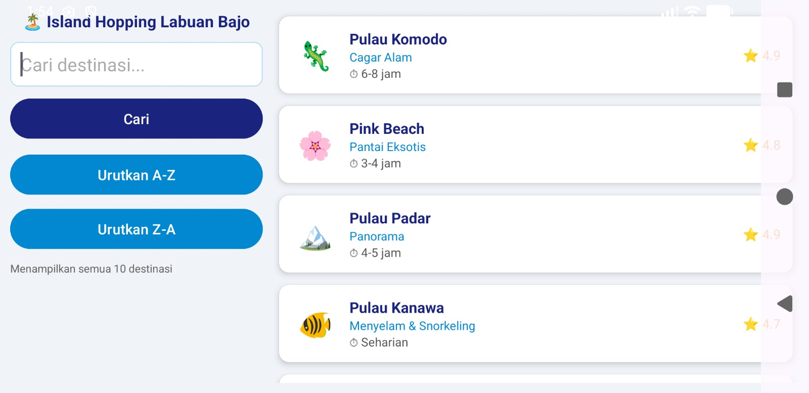
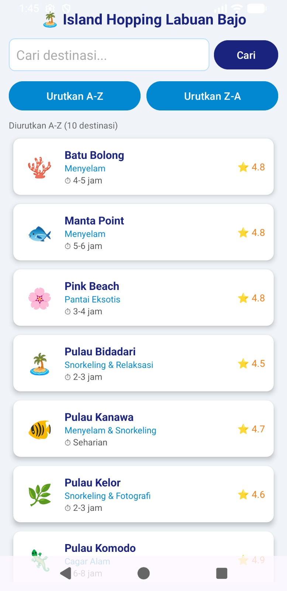
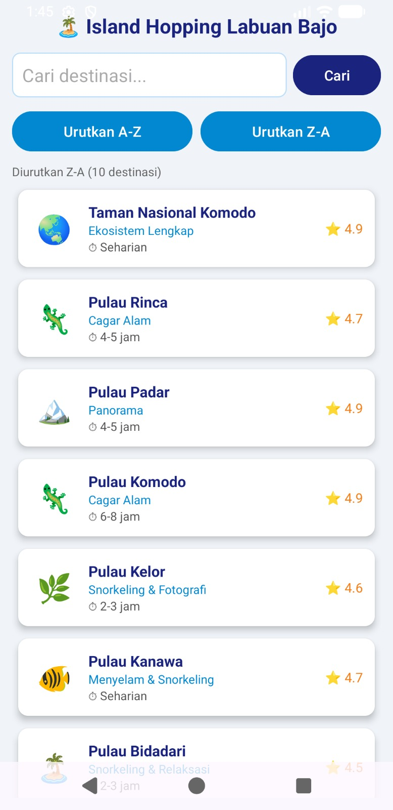
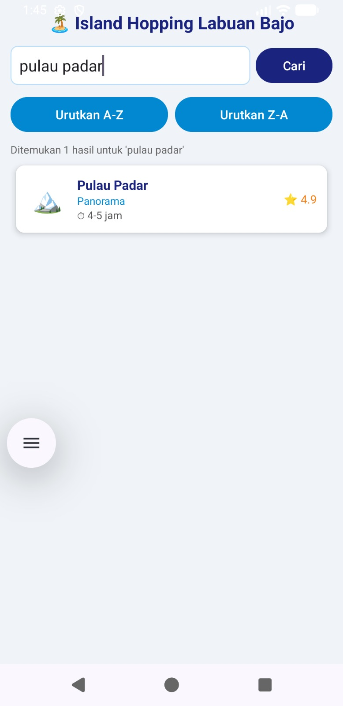
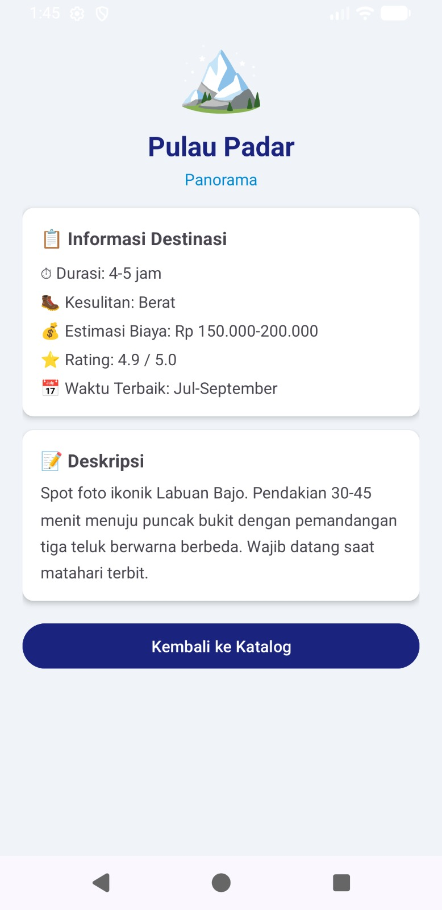
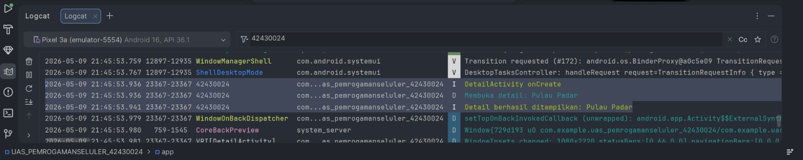

<div align="center">

# 🏝️ Island Hopping Labuan Bajo

### *Jelajahi Keindahan Laut Flores dari Genggaman Tanganmu*

</div>
---

## 🪪 Identitas

| Keterangan    | Detail                           |
|---------------|----------------------------------|
| **Nama**      | Nayge Audrey Jemahi              |
| **NIM**       | **42430024**                     |
| **Mata Kuliah** | Pemrograman Seluler              |
| **Tema**      | Katalog Destinasi Island Hopping |
| **Platform**  | Android                          |
| **Bahasa**    | Kotlin + XML Layout              |

---

## I. Abstract

Aplikasi **Island Hopping Labuan Bajo** merupakan aplikasi katalog destinasi wisata bahari berbasis Android. Dikembangkan menggunakan **Kotlin** dan **XML Layout**, aplikasi ini menyajikan 10 destinasi unggulan kawasan Labuan Bajo, Taman Nasional Komodo, Pink Beach, Pulau Padar, dan lainnya. Sistem mendukung pencarian destinasi menggunakan **Linear Search**, pengurutan nama menggunakan **Bubble Sort**, tampilan detail destinasi via **Intent**, serta pencatatan aktivitas melalui **Logcat** bertag NIM.

**Keywords:** Android, Kotlin, ArrayList, Linear Search, Bubble Sort, Intent, RecyclerView, Logcat.

---

## II. Introduction

Proyek ini dibuat sebagai implementasi UAS mata kuliah **Pemrograman Seluler** dengan pendekatan *projectbased learning*. Tema yang dipilih adalah katalog wisata **Island Hopping Labuan Bajo** karena kawasan ini merupakan salah satu destinasi prioritas pariwisata Indonesia yang kaya akan biodiversitas laut dan landmark alam ikonik.

Tujuan utama aplikasi ini adalah menampilkan informasi destinasi secara terstruktur, menyediakan fitur pencarian dan pengurutan data, serta memvisualisasikan alur navigasi antar halaman menggunakan Intent Android.

---

## III. System Design

Aplikasi terdiri dari **dua halaman utama** yang saling terhubung melalui Intent:

| Activity         | Fungsi                                                              |
|------------------|---------------------------------------------------------------------|
| `MainActivity`   | Menampilkan katalog destinasi, fitur pencarian, dan sort A-Z / Z-A |
| `DetailActivity` | Menampilkan detail lengkap destinasi yang dipilih                   |


---

## IV. Implementation

### A. Data Model

Data destinasi dimodelkan dalam class `Destinasi` dengan atribut nama, kategori, durasi, kesulitan, estimasi biaya, rating, waktu terbaik, deskripsi, dan ikon emoji.

### B. ArrayList Dataset

Seluruh data 10 destinasi disimpan dalam `ArrayList` pada `DataDestinasiUtils.kt` tanpa database eksternal, digunakan sebagai sumber data untuk RecyclerView, pencarian, dan pengurutan.

### C. Linear Search

Pencarian dilakukan secara manual dengan memeriksa setiap elemen ArrayList berdasarkan kecocokan keyword terhadap nama destinasi (case-insensitive).

```kotlin
for (item in destiList) {
    if (item.nama.lowercase().contains(keyword.lowercase())) {
        hasil.add(item)
    }
}
```

### D. Bubble Sort

Pengurutan A-Z dan Z-A diimplementasikan menggunakan algoritma Bubble Sort berdasarkan nama destinasi.

```kotlin
if (list[j].nama.lowercase() > list[j + 1].nama.lowercase()) {
    val temp = list[j]; list[j] = list[j + 1]; list[j + 1] = temp
}
```

### E. Intent Navigation

Navigasi dari `MainActivity` ke `DetailActivity` menggunakan `putExtra()` untuk mengirimkan data destinasi yang dipilih.

### F. Logcat

Seluruh aktivitas penting aplikasi (buka halaman, hasil pencarian, aksi sort) dicatat menggunakan Logcat dengan tag NIM:

```
42430024
```

---

## V. Module Compliance

| Modul          | Implementasi                                             |
|----------------|----------------------------------------------------------|
| Modul 2 & 3    | UI responsif portrait & landscape, tema biru-putih bersih |
| Modul 4 & 5    | Intent antar Activity + data transfer via `putExtra()`   |
| Modul 6        | ArrayList sebagai struktur data + Linear Search          |
| Modul 7        | Bubble Sort A-Z dan Z-A                                  |
| Modul 9        | Try-catch pada konversi data + Logcat bertag NIM         |

---

## VI. User Interface Documentation

### A. Tampilan Utama

| Default View | Landscape Mode |
|:---:|:---:|
|  |  |
| Menampilkan semua 10 destinasi | Tampilan menyesuaikan layar horizontal |

### B. Pencarian & Pengurutan

| Sort A-Z | Sort Z-A | Search Result |
|:---:|:---:|:---:|
|  |  |  |
| Bubble Sort ascending | Bubble Sort descending | Linear Search: "pulau padar" |

### C. Detail Destinasi

| Halaman Detail | Logcat Evidence |
|:---:|:---:|
|  |  |
| Info lengkap Pulau Padar | Log aktivitas bertag `42430024` |

---

## VII. Testing Result

| No | Test Case                      | Expected Result                  | Status      |
|----|--------------------------------|----------------------------------|-------------|
| 1  | Buka aplikasi                  | MainActivity tampil              | ✅ Passed   |
| 2  | RecyclerView load data         | 10 destinasi muncul              | ✅ Passed   |
| 3  | Search "pulau padar"           | 1 hasil ditemukan                | ✅ Passed   |
| 4  | Sort A-Z                       | Urutan abjad ascending           | ✅ Passed   |
| 5  | Sort Z-A                       | Urutan abjad descending          | ✅ Passed   |
| 6  | Klik item destinasi            | DetailActivity terbuka           | ✅ Passed   |
| 7  | Tombol "Kembali ke Katalog"    | Kembali ke MainActivity          | ✅ Passed   |
| 8  | Landscape mode                 | Layout menyesuaikan orientasi    | ✅ Passed   |
| 9  | Logcat filter NIM              | Aktivitas tercatat dengan tag    | ✅ Passed   |

---

## VIII. How to Run

1. Clone repository ini
2. Buka project di **Android Studio**
3. Jalankan **Gradle Sync**
4. Pilih emulator atau perangkat fisik Android (min API 24)
5. Klik ▶ **Run**
6. Untuk memantau Logcat, filter menggunakan tag:

```
42430024
```

---

## IX. Conclusion

Aplikasi **Island Hopping Labuan Bajo** berhasil diimplementasikan sesuai dengan ketentuan UAS Pemrograman Seluler. Aplikasi ini membuktikan kemampuan pengembangan Android native menggunakan Kotlin, mencakup desain UI yang bersih dan informatif, navigasi multi-Activity, operasi data menggunakan ArrayList, serta implementasi algoritma Linear Search dan Bubble Sort tanpa library eksternal.

---

<div align="center">

🌊 *Built with passion for the sea. Developed for the course.*

**UAS Pemrograman Seluler — 2026**

</div>
